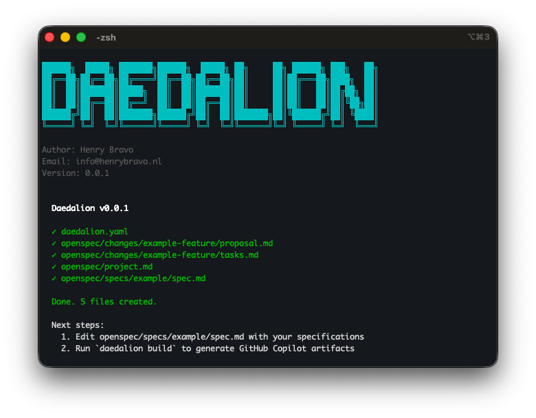
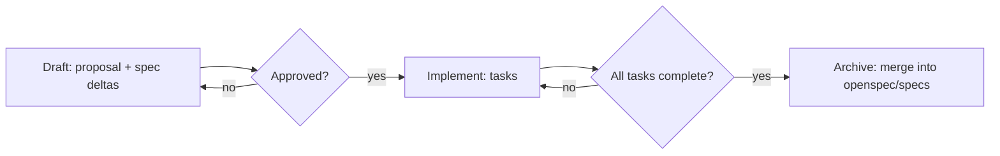

# Daedalion

[](https://nodejs.org/)
[](https://opensource.org/licenses/MIT)
[](https://www.npmjs.com/package/daedalion)

Spec-to-Agent compiler for GitHub Copilot. Write specs; get agents, skills, and prompts — all kept in sync with your source of truth.

> *"Write specs, get agents automatically."*



## Overview

Daedalion turns your `openspec/` specifications into native GitHub Copilot artifacts — agents, skills, prompts, and instructions. Your specs stay the source of truth; agents stay in sync automatically.

```
OpenSpec (what) ───▶ Daedalion ───▶ GitHub Copilot (how)
```

## Core Goal: Spec-Driven Development with AI

**Daedalion's primary mission:** Ensure humans and AIs agree on **what to build** *before* any code is written.

When you run `daedalion build`, it generates **`.github/prompts/daedalion-openspec-cycle.prompt.md`** — a guided workflow that:

1. Routes AI to draft **proposals** (why, goals, scope) + **spec deltas** (what needs to change)
2. Blocks coding until the **human explicitly approves specs**
3. Guides implementation via a clear **task checklist**
4. Archives completed changes and **merges specs into canonical truth**

This prompt is your **AI code coordinator** — it prevents costly rework by enforcing spec clarity and human review at every phase.

**The result:** Predictable, spec-aligned development where both humans and AIs follow the same playbook.

## Why Daedalion + OpenSpec

- Aligns humans and AIs on the “what” before any code.
- Enforces approval gates with an AI coordinator prompt.
- Generates native Copilot artifacts from `openspec/` automatically.
- Prevents drift with `validate` and supports CI.

## The Core Idea

`daedalion build` generates `.github/prompts/daedalion-openspec-cycle.prompt.md` — your AI code coordinator that:
- Routes work: proposal → review → implementation → archive
- Blocks coding until specs are explicitly approved
- Keeps tasks and deltas in lockstep with human review



## Quick Start

```bash
npm install -g openspec daedalion
openspec init                # creates openspec/ + AGENTS.md
daedalion init               # adds daedalion.yaml + project.md (minimal)
daedalion init --with-example # includes example specs and changes
daedalion build              # generates Copilot artifacts (agents, skills, prompts)
daedalion validate           # checks specs ↔ artifacts are in sync
```

Use the coordinator by asking your AI: “Help me work through the OpenSpec cycle.”

## What It Generates

```
.github/
├── prompts/
│   ├── daedalion-openspec-cycle.prompt.md  # AI coordinator (spec-driven workflow)
│   └── {change}.prompt.md                  # Slash prompts for active changes
├── agents/{domain}.agent.md                # Domain personas
├── skills/{domain}/SKILL.md                # Auto-loaded skills from specs
├── copilot-instructions.md                 # Project context from openspec/project.md
└── workflows/daedalion.yml                 # Optional CI (validate / auto-regenerate)
```

## Commands

- `daedalion init` - Scaffolds a new project:

```
project/
├── daedalion.yaml
└── openspec/
    └── project.md
```

  Add `--with-example` to include example specs and changes:

```
project/
├── daedalion.yaml
└── openspec/
    ├── project.md
    ├── specs/
    │   └── example/
    │       └── spec.md
    └── changes/
        └── example-feature/
            ├── proposal.md
            └── tasks.md
```

- `daedalion build` - Generates GitHub Copilot artifacts from your specs:

```
.github/
├── skills/
│   └── {domain}/
│       └── SKILL.md
├── agents/
│   └── {domain}.agent.md
├── prompts/
│   └── {change-name}.prompt.md
├── workflows/
│   └── daedalion.yml
└── copilot-instructions.md
```

- `daedalion validate` — Verify specs and artifacts are in sync
- `daedalion clean` — Remove only Daedalion-generated files


## Learn More

- OpenSpec format and conventions: [docs/openspec-format.md](docs/openspec-format.md)
- Generated output details: [docs/generated-output.md](docs/generated-output.md)
- CI setup and options: [docs/ci-workflow.md](docs/ci-workflow.md)
- Developer notes: [docs/DEVELOPER.md](docs/DEVELOPER.md)

## License

MIT

